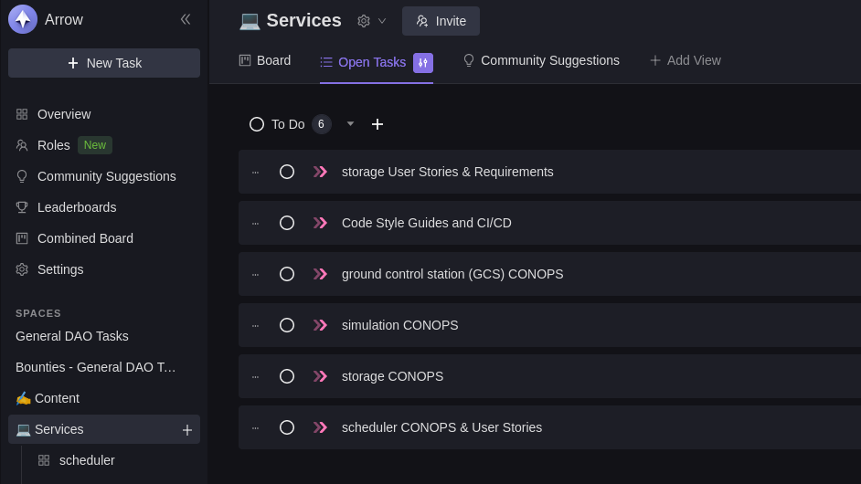
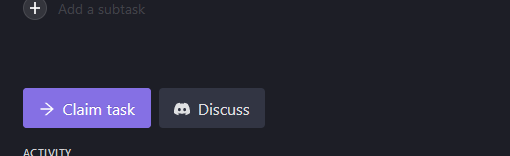
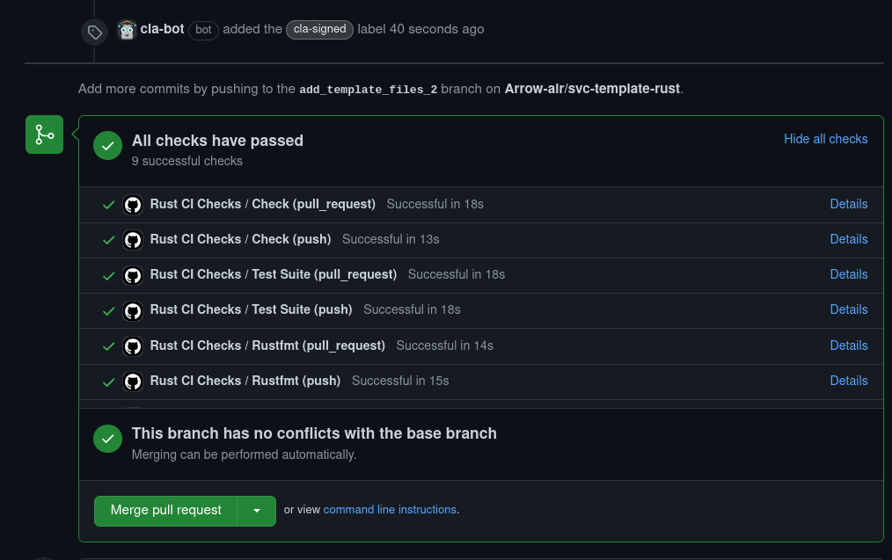
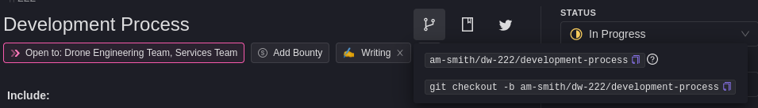

# Development Guide

## :paw_prints: First Steps
1. Create an account: [GitHub](https://github.com/)
2. Create an account: [Discord](https://discord.com/)
3. Sign the [CLA](https://www.arrowair.com/docs/contributing/cla)
4. Join the [Arrow Discord](https://discord.com/invite/fab4bxaAW9)
    - Be sure to visit the `#start-contributing` channel and give yourself a role!
5. Set up a GPG Key
    - See [Sign Your Commits](#-sign-your-commits) for instructions

## :carousel_horse: Workflow
### :round_pushpin: Claim a Task
1. Visit the [Arrow DeWork](https://app.dework.xyz/arrow-air)
    - Sign in with your Discord credentials
3. View open tasks
    - 
4. Claim a task, easy as a button click!
    - 
    - Some important tasks are by **application only**. Describe why you're a good fit for the task!

### :wrench: Work on a Task
:exclamation: See our [Git Guidelines](#-git-guidelines)
1. Clone or fork the target repository.
    - If you are not a core member on an [Arrow GitHub team](https://github.com/orgs/Arrow-air/teams), you will need to work from a fork.
    - [How to Fork a Repository](https://docs.github.com/en/get-started/quickstart/fork-a-repo)
2. Create a branch.
    - Our branch names are generated by DeWork! See our [branch guidelines](#-branches).
3. Code!
    - Be sure to follow our [Code Style Guides](./styleguides/intro.md)!
4. :exclamation: **Sign** :exclamation: your changes and push to the remote.
    - Commits to the all remote branches must be signed
    - See [Sign Your Commits](#-sign-your-commits) for instructions on setting up a GPG Key
    - Use the `-S` option to sign your commits
        - `git commit -S -m "Add README.md"`

### :checkered_flag: Push Changes
1. Make a pull request.
    - A "Pull Request" is a request to merge your branch into the `main` branch.
    - [How to create a pull request from a fork](https://docs.github.com/en/pull-requests/collaborating-with-pull-requests/proposing-changes-to-your-work-with-pull-requests/creating-a-pull-request-from-a-fork).
    - If making edits to the [website](https://github.com/Arrow-air/website/), seek to merge your PR into the website `staging` branch instead.
2. Confirm the presence of the `cla-signed` label.
    - If you haven't signed the [CLA](./cla.mdx), the cla-bot will be disappointed :angry:
3. Confirm that the GitHub Actions checks pass.
     - These checks will vary from repository to repository
     - 
4. Get approvals!
    - The number of approvals may vary from repo to repo.
    - Approvals generally need to come from core members of the [Arrow teams](https://github.com/orgs/Arrow-air/teams).
5. Merge!

## :zap: VS Code Extensions

These extensions are **recommended**:

```bash
# In VS Code Quick Open (Ctrl+P)
ext install \
bierner.github-markdown-preview \
rust-lang.rust-analyzer \
ms-python.python \
docsmsft.docs-yaml \
njpwerner.autodocstring \
stkb.rewrap \
eamodio.gitlens \
ms-vscode-remote.vscode-remote-extensionpack \
tamasfe.even-better-toml \
```

- [GitHub Markdown Preview](https://marketplace.visualstudio.com/items?itemName=bierner.github-markdown-preview)
    - Includes `mermaid` (uml) rendering and emoji rendering in markdown preview pane
- [rust-analyzer](https://marketplace.visualstudio.com/items?itemName=rust-lang.rust-analyzer&ssr=false#overview)
    - Linting, "go to" support, types and docs on hover, etc.
- [Python](https://marketplace.visualstudio.com/items?itemName=ms-python.python)
    - Syntax highlighting, linting, intellisense
- [docs-yaml](https://marketplace.visualstudio.com/items?itemName=docsmsft.docs-yaml&ssr=false)
    - Intellisense, validation for YAML files
- [Even Better
  TOML](https://marketplace.visualstudio.com/items?itemName=tamasfe.even-better-toml)
    - TOML files are used for Rust configuration
    - Validation, syntax highlighting
- [autoDocstring](https://marketplace.visualstudio.com/items?itemName=njpwerner.autodocstring)
    - Python docstring generator
- [Rewrap](https://marketplace.visualstudio.com/items?itemName=stkb.rewrap)
    - Wrap code comments to fit within n characters
    - Need to enable this in Preferences->Settings->type "Rewrap"
    - 80 characters is the recommended column
- [GitLens](https://marketplace.visualstudio.com/items?itemName=eamodio.gitlens)
    - Hover over lines to see commit history, last author
- [Remote Development](https://marketplace.visualstudio.com/items?itemName=ms-vscode-remote.vscode-remote-extensionpack)
    - For working over SSH

## :construction: Git Guidelines

### :deciduous_tree: Branches

The branch name should be copied from a [Arrow
DeWork](https://app.dework.xyz/arrow-air) task.


- e.g. `am-smith/dw-227/rust-service-template`
- This links your work to a ticket
- Closing a pull request with this branch will also mark the DeWork task as "Done"!

### :lock_with_ink_pen: Sign Your Commits

We enforce signed commits to authenticate commits from an author.
- Security, accountability, traceability
- ["How (and why) to sign Git commits" - Alessandro Segala](https://withblue.ink/2020/05/17/how-and-why-to-sign-git-commits.html)

:exclamation: All remote branches are protected from unsigned commits through
GitHub repository settings.

Setting up a GPG Key:
- [Generate a GPG
  Key](https://docs.github.com/en/authentication/managing-commit-signature-verification/generating-a-new-gpg-key)
- [Informing Git about your GPG Key](https://docs.github.com/en/authentication/managing-commit-signature-verification/telling-git-about-your-signing-key)
- [Informing GitHub about your GPG Key](https://docs.github.com/en/authentication/managing-commit-signature-verification/adding-a-new-gpg-key-to-your-github-account)
- All commits signed by default: `git config --global commit.gpgsign true`

Add an `-S` to your commit command to sign it, e.g. `git commit -S -m "Add
README.md"`.

### :speech_balloon: Commit Messages

As described [here](https://github.com/marketplace/actions/dynamic-badges#git-commit-messages):
- Message should be in present tense (**Add new feature** instead of **Added new feature**)
  - Should be written as if giving a command or instruction (**Remove bug X**, **Update README.md**)
- Message should start with a capital letter (**Add new feature**)
- Emojis, if used, should be at the start of the message (**:tada: Add new feature**)

Additionally:
- Do not exceed a line length of 50 characters for commit title
- Do not exceed a line length of 72 characters for commit body
- Do **not** end the message with a period

Keep these in mind always, especially when squashing commits (one message).

### :+1: Pull Requests

- Keep PRs small and easy to review!
    - Our [reviewers](./peerreview.md) may ask you to divide your PR into
      multiple smaller PRs.
- If the commit history is messy, recommend "Squash and Merge" when pushing in
  changes.
    - The squashed commit should have a thorough description of the changes
      added.
- The Pull Request comments should be descriptive
    - A brief description of what was changed and why
- Your PR should equate to one DeWork issue
    - Addressing multiple tickets in one merge makes it harder to debug breaking changes.
    - Use `git commit --fixup <commit sha>` to fix a previous commit. 
## :books: Repositories (Create, Modify, Delete)

Repositories are managed through [Terraform](https://www.terraform.io/).

Requests for repository management should be made to @owlot.

## :closed_lock_with_key: Admin Access

Elevated access to our various team platforms is limited.

Ping @thomasg or @owlot and describe what you want to do.